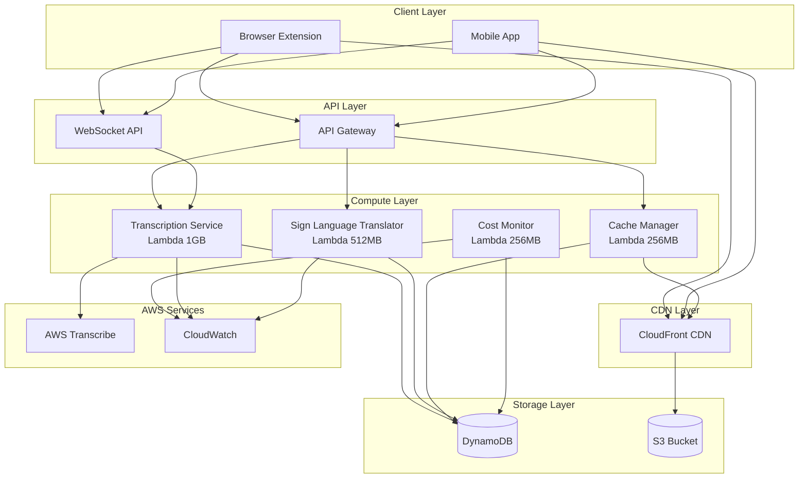
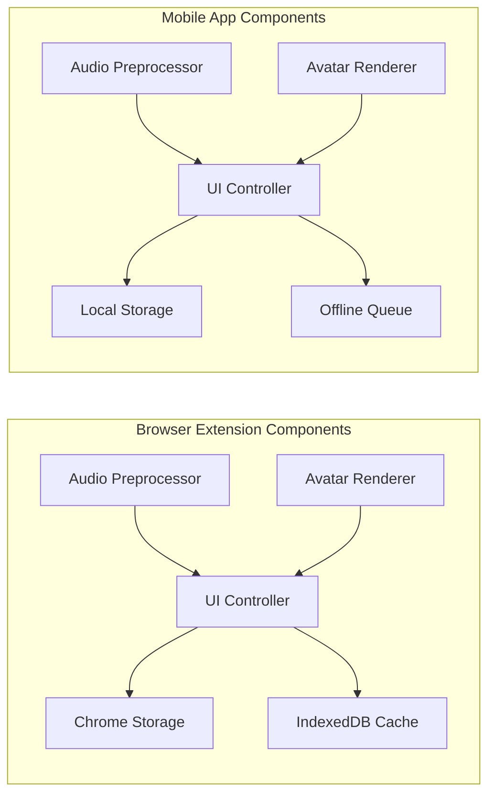
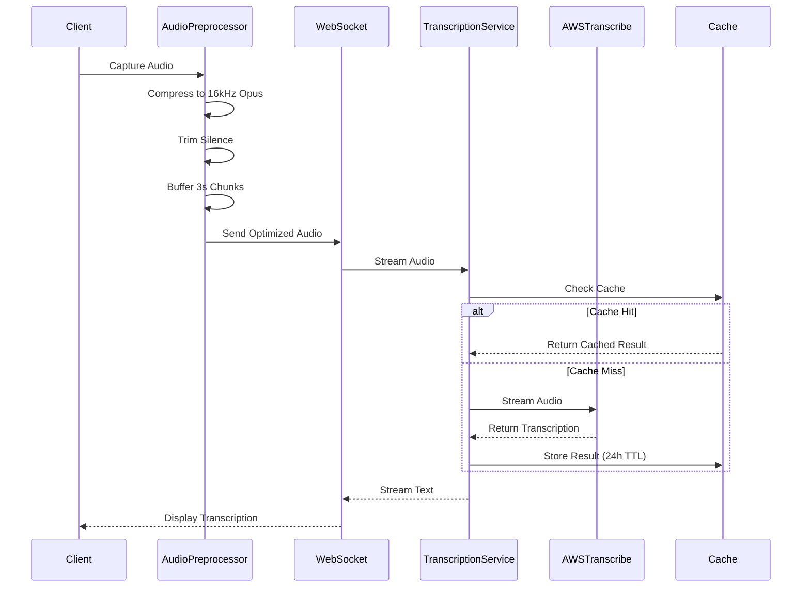
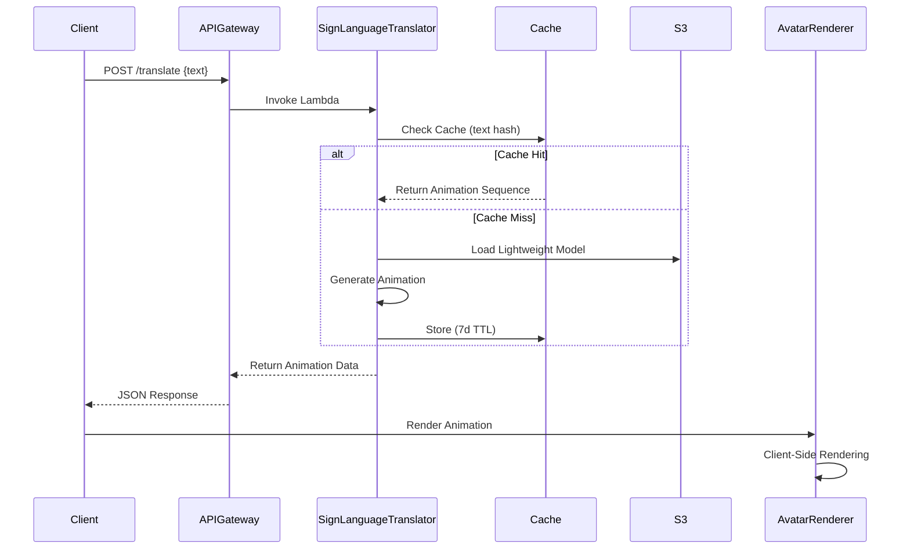
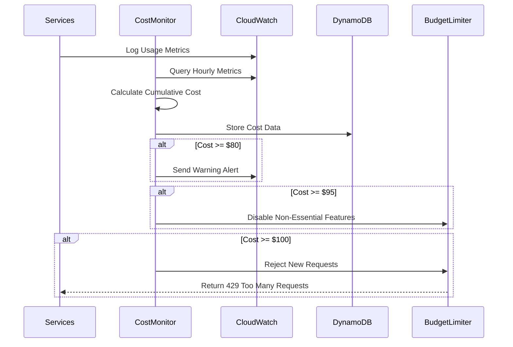

 # Technical Design Document

## Overview

The Accessibility AI Serverless System is a cost-optimized, serverless architecture that provides real-time speech-to-text transcription and sign language translation for deaf and hard-of-hearing users. The system leverages AWS serverless services (Lambda, API Gateway, DynamoDB, S3, CloudFront) with aggressive caching and client-side processing to operate within a strict $100/month budget while supporting up to 500 active users.

### Key Design Principles

1. **Cost-First Architecture**: Every design decision prioritizes cost optimization while maintaining core functionality
2. **Client-Side Processing**: Maximize client-side computation (audio preprocessing, avatar rendering) to minimize server costs
3. **Aggressive Caching**: Multi-layer caching strategy (CloudFront, DynamoDB, client-side) to reduce duplicate processing
4. **Serverless-Native**: Leverage AWS serverless services for automatic scaling and pay-per-use pricing
5. **Budget Enforcement**: Proactive monitoring and hard limits to prevent budget overruns

### System Context

The system consists of two client applications (Chrome extension and Android app) that communicate with AWS serverless backend services. Audio processing happens primarily on the client, with only optimized audio sent to AWS Transcribe. Sign language models are lightweight and cached aggressively to minimize Lambda invocations and data transfer.

## Architecture

### High-Level Architecture



### Component Architecture



### Data Flow Diagrams

#### Real-Time Transcription Flow



#### Sign Language Translation Flow



#### Cost Monitoring Flow



## Components and Interfaces

### 1. Browser Extension

**Purpose**: Chrome extension providing transcription and sign language features on any website.

**Key Components**:

- Audio Preprocessor: Client-side audio optimization
- Avatar Renderer: WebGL-based sign language animation
- UI Controller: Manages overlay windows and user interactions
- Storage Manager: Handles Chrome storage and IndexedDB caching

**Interfaces**:

```typescript
interface AudioPreprocessor {
  captureAudio(source: MediaStream): void;
  compressAudio(audio: AudioBuffer): CompressedAudio;
  trimSilence(audio: AudioBuffer, threshold: number): AudioBuffer;
  bufferChunks(audio: AudioBuffer, chunkSize: number): AudioChunk[];
}

interface AvatarRenderer {
  loadAvatar(avatarId: string): Promise<Avatar>;
  renderAnimation(sequence: AnimationSequence): void;
  setFrameRate(fps: number): void;
  customizeAvatar(options: AvatarOptions): void;
}

interface UIController {
  showTranscriptionOverlay(text: string): void;
  showAvatarWindow(avatar: Avatar): void;
  showControlPanel(): void;
  updateSettings(settings: UserSettings): void;
}
```

### 2. Mobile App (Android)

**Purpose**: Native Android application providing accessibility features on mobile devices.

**Key Components**:

- Audio Preprocessor: Native audio capture and optimization
- Avatar Renderer: OpenGL ES-based animation
- Offline Queue: Manages requests when network unavailable
- Local Cache: Stores avatar assets and preferences

**Interfaces**:

```kotlin
interface AudioPreprocessor {
    fun captureAudio(source: AudioSource): Unit
    fun compressAudio(audio: AudioBuffer): CompressedAudio
    fun trimSilence(audio: AudioBuffer, threshold: Float): AudioBuffer
    fun bufferChunks(audio: AudioBuffer, chunkSize: Int): List<AudioChunk>
}

interface AvatarRenderer {
    suspend fun loadAvatar(avatarId: String): Avatar
    fun renderAnimation(sequence: AnimationSequence): Unit
    fun setFrameRate(fps: Int): Unit
    fun customizeAvatar(options: AvatarOptions): Unit
}

interface OfflineQueue {
    fun enqueue(request: TranscriptionRequest): Unit
    fun processQueue(): Unit
    fun clearQueue(): Unit
}
```

### 3. API Gateway

**Purpose**: Routes HTTP and WebSocket requests to Lambda functions with authentication and rate limiting.

**Configuration**:

```yaml
RestAPI:
  Endpoints:
    - POST /translate
    - GET /preferences
    - PUT /preferences
    - GET /health
  RateLimiting: 100 requests/user/hour
  Authentication: API Key

WebSocketAPI:
  Routes:
    - $connect
    - $disconnect
    - transcribe
  ConnectionLimit: 1000 concurrent
  IdleTimeout: 10 minutes
```

**Interfaces**:

```typescript
// REST API
interface TranslateRequest {
  text: string;
  targetLanguage: "ASL" | "BSL";
  userId: string;
}

interface TranslateResponse {
  animationSequence: AnimationSequence;
  cacheHit: boolean;
  duration: number;
}

// WebSocket API
interface TranscribeMessage {
  action: "transcribe";
  audioChunk: string; // base64 encoded
  language: string;
  sessionId: string;
}

interface TranscribeResponse {
  text: string;
  isFinal: boolean;
  confidence: number;
  timestamp: number;
}
```

### 4. Transcription Service (Lambda)

**Purpose**: Orchestrates AWS Transcribe for speech-to-text conversion with caching.

**Configuration**:

- Memory: 1GB
- Timeout: 30 seconds
- Concurrency: 100
- Environment Variables: `TRANSCRIBE_REGION`, `CACHE_TABLE`, `SUPPORTED_LANGUAGES`

**Interfaces**:

```typescript
interface TranscriptionService {
  streamTranscribe(
    audioStream: ReadableStream,
    language: string,
    sessionId: string,
  ): AsyncIterator<TranscriptionResult>;

  batchTranscribe(
    audioUrl: string,
    language: string,
  ): Promise<TranscriptionResult>;

  checkCache(audioHash: string): Promise<TranscriptionResult | null>;
  storeCache(audioHash: string, result: TranscriptionResult): Promise<void>;
}

interface TranscriptionResult {
  text: string;
  confidence: number;
  isFinal: boolean;
  timestamp: number;
  language: string;
}
```

**Implementation Details**:

- Uses AWS Transcribe Streaming API for real-time transcription
- Implements audio hashing for cache lookups
- Processes audio in 3-second chunks to optimize costs
- Falls back to batch mode for non-real-time requests (50% cost savings)

### 5. Sign Language Translator (Lambda)

**Purpose**: Converts text to sign language animation sequences using lightweight models.

**Configuration**:

- Memory: 512MB
- Timeout: 10 seconds
- Concurrency: 100
- Environment Variables: `MODEL_BUCKET`, `CACHE_TABLE`, `SUPPORTED_SIGN_LANGUAGES`

**Interfaces**:

```typescript
interface SignLanguageTranslator {
  translate(
    text: string,
    targetLanguage: "ASL" | "BSL",
  ): Promise<AnimationSequence>;

  loadModel(language: string): Promise<SignLanguageModel>;
  checkCache(textHash: string): Promise<AnimationSequence | null>;
  storeCache(textHash: string, sequence: AnimationSequence): Promise<void>;
}

interface AnimationSequence {
  frames: AnimationFrame[];
  duration: number;
  language: string;
  metadata: {
    wordCount: number;
    complexity: "simple" | "moderate" | "complex";
  };
}

interface AnimationFrame {
  timestamp: number;
  joints: JointPosition[];
  facialExpression?: FacialExpression;
}
```

**Implementation Details**:

- Loads lightweight models (<100MB) from S3 on cold start
- Implements text hashing for cache lookups
- Generates animation sequences using pre-trained models
- Optimizes output format for client-side rendering

### 6. Cache Manager (Lambda)

**Purpose**: Manages DynamoDB and CloudFront caching with TTL and eviction policies.

**Configuration**:

- Memory: 256MB
- Timeout: 5 seconds
- Concurrency: 50
- Scheduled: Runs every hour for cleanup

**Interfaces**:

```typescript
interface CacheManager {
  get(key: string, cacheType: CacheType): Promise<CachedItem | null>;
  set(
    key: string,
    value: any,
    ttl: number,
    cacheType: CacheType,
  ): Promise<void>;
  invalidate(key: string, cacheType: CacheType): Promise<void>;
  evictLRU(cacheType: CacheType, targetSize: number): Promise<void>;
  getStats(): Promise<CacheStats>;
}

enum CacheType {
  TRANSCRIPTION = "transcription",
  ANIMATION = "animation",
  PREFERENCES = "preferences",
}

interface CachedItem {
  key: string;
  value: any;
  ttl: number;
  createdAt: number;
  lastAccessed: number;
  size: number;
}

interface CacheStats {
  totalSize: number;
  itemCount: number;
  hitRate: number;
  evictionCount: number;
}
```

**Implementation Details**:

- Manages DynamoDB TTL for automatic expiration
- Implements LRU eviction when cache exceeds 5GB
- Tracks cache hit rates for optimization
- Invalidates CloudFront cache when needed

### 7. Cost Monitor (Lambda)

**Purpose**: Tracks AWS spending and enforces budget limits with proactive alerts.

**Configuration**:

- Memory: 256MB
- Timeout: 5 seconds
- Concurrency: 10
- Scheduled: Runs every hour

**Interfaces**:

```typescript
interface CostMonitor {
  calculateCurrentSpending(): Promise<CostBreakdown>;
  checkBudgetThresholds(): Promise<BudgetStatus>;
  sendAlert(alertType: AlertType, details: AlertDetails): Promise<void>;
  generateDailyReport(): Promise<CostReport>;
  enforceLimit(limitType: LimitType): Promise<void>;
}

interface CostBreakdown {
  total: number;
  byService: {
    lambda: number;
    apiGateway: number;
    transcribe: number;
    dynamodb: number;
    s3: number;
    cloudfront: number;
  };
  projectedMonthly: number;
}

interface BudgetStatus {
  currentSpending: number;
  budgetLimit: number;
  percentageUsed: number;
  daysRemaining: number;
  status: "normal" | "warning" | "critical" | "exceeded";
}

enum AlertType {
  WARNING_80 = "warning_80",
  CRITICAL_95 = "critical_95",
  EXCEEDED_100 = "exceeded_100",
  ERROR_RATE = "error_rate",
  LATENCY = "latency",
}
```

**Implementation Details**:

- Queries CloudWatch metrics for service usage
- Calculates costs using AWS pricing API
- Stores historical data in DynamoDB
- Sends SNS notifications for alerts
- Implements budget enforcement by updating API Gateway throttling

### 8. CloudFront CDN

**Purpose**: Global content delivery for avatar assets and models with edge caching.

**Configuration**:

```yaml
Distribution:
  PriceClass: PriceClass_100 # North America and Europe only
  Origins:
    - S3Bucket: accessibility-ai-models
  CacheBehaviors:
    - PathPattern: /avatars/*
      TTL: 2592000 # 30 days
      Compress: true
    - PathPattern: /models/*
      TTL: 2592000 # 30 days
      Compress: true
  CustomErrorResponses:
    - ErrorCode: 404
      ResponseCode: 200
      ResponsePagePath: /index.html
```

### 9. DynamoDB Tables

**Purpose**: Stores user preferences, cache data, and cost tracking information.

**Schema**:

```typescript
// User Preferences Table
interface UserPreferencesTable {
  PK: string; // USER#{userId}
  SK: string; // PREFS
  language: string;
  signLanguage: "ASL" | "BSL";
  avatarId: string;
  displaySettings: {
    fontSize: number;
    fontColor: string;
    position: "top" | "bottom" | "custom";
  };
  createdAt: number;
  updatedAt: number;
}

// Cache Table
interface CacheTable {
  PK: string; // CACHE#{type}#{hash}
  SK: string; // CACHE
  value: any;
  ttl: number; // DynamoDB TTL attribute
  size: number;
  lastAccessed: number;
  accessCount: number;
}

// Cost Tracking Table
interface CostTrackingTable {
  PK: string; // COST#{date}
  SK: string; // SERVICE#{serviceName}
  amount: number;
  usage: number;
  timestamp: number;
}
```

**Capacity Configuration**:

- Billing Mode: On-Demand (with provisioned capacity for free tier where applicable)
- User Preferences: 5 RCU / 5 WCU (free tier)
- Cache: On-Demand (scales with usage)
- Cost Tracking: On-Demand

### 10. S3 Storage

**Purpose**: Stores sign language models, avatar assets, and static resources.

**Bucket Structure**:

```
accessibility-ai-models/
├── models/
│   ├── asl-lightweight-v1.bin (80MB)
│   └── bsl-lightweight-v1.bin (85MB)
├── avatars/
│   ├── avatar-1/
│   │   ├── mesh.glb
│   │   ├── textures/
│   │   └── metadata.json
│   └── avatar-2/
│       ├── mesh.glb
│       ├── textures/
│       └── metadata.json
└── static/
    ├── fonts/
    └── icons/
```

**Storage Classes**:

- Models: S3 Standard-IA (infrequently accessed, loaded on Lambda cold start)
- Avatars: S3 Standard (frequently accessed via CloudFront)
- Static: S3 Standard

**Lifecycle Policies**:

- Archive old model versions to Glacier after 90 days
- Delete incomplete multipart uploads after 7 days

## Data Models

### Core Domain Models

```typescript
// User Model
interface User {
  userId: string;
  email: string;
  createdAt: Date;
  preferences: UserPreferences;
  subscription: SubscriptionTier;
  usageStats: UsageStats;
}

interface UserPreferences {
  language: string;
  signLanguage: "ASL" | "BSL";
  avatarId: string;
  displaySettings: DisplaySettings;
  offlineMode: boolean;
}

interface DisplaySettings {
  fontSize: number;
  fontColor: string;
  backgroundColor: string;
  position: "top" | "bottom" | "custom";
  customPosition?: { x: number; y: number };
}

interface UsageStats {
  transcriptionMinutes: number;
  translationRequests: number;
  lastActive: Date;
  monthlyUsage: MonthlyUsage;
}

interface MonthlyUsage {
  month: string;
  transcriptionMinutes: number;
  translationRequests: number;
  estimatedCost: number;
}

// Audio Models
interface AudioChunk {
  data: ArrayBuffer;
  format: AudioFormat;
  duration: number;
  timestamp: number;
  sessionId: string;
}

interface AudioFormat {
  sampleRate: number;
  channels: number;
  codec: "opus" | "pcm";
  bitrate: number;
}

interface CompressedAudio {
  data: ArrayBuffer;
  originalSize: number;
  compressedSize: number;
  compressionRatio: number;
  format: AudioFormat;
}

// Sign Language Models
interface SignLanguageModel {
  modelId: string;
  language: "ASL" | "BSL";
  version: string;
  size: number;
  vocabulary: string[];
  weights: ArrayBuffer;
  metadata: ModelMetadata;
}

interface ModelMetadata {
  trainedOn: Date;
  accuracy: number;
  supportedGestures: number;
  averageInferenceTime: number;
}

interface AnimationSequence {
  sequenceId: string;
  frames: AnimationFrame[];
  duration: number;
  language: "ASL" | "BSL";
  sourceText: string;
  metadata: AnimationMetadata;
}

interface AnimationFrame {
  frameNumber: number;
  timestamp: number;
  joints: JointPosition[];
  facialExpression?: FacialExpression;
  handShape?: HandShape;
}

interface JointPosition {
  jointId: string;
  position: Vector3;
  rotation: Quaternion;
}

interface Vector3 {
  x: number;
  y: number;
  z: number;
}

interface Quaternion {
  x: number;
  y: number;
  z: number;
  w: number;
}

interface FacialExpression {
  eyebrows: number;
  eyes: number;
  mouth: number;
  intensity: number;
}

interface HandShape {
  left: string;
  right: string;
}

interface AnimationMetadata {
  wordCount: number;
  complexity: "simple" | "moderate" | "complex";
  generatedAt: Date;
  cacheKey: string;
}

// Session Models
interface TranscriptionSession {
  sessionId: string;
  userId: string;
  connectionId: string;
  language: string;
  startTime: Date;
  endTime?: Date;
  status: "active" | "paused" | "completed" | "error";
  audioProcessed: number; // seconds
  costAccrued: number;
}

// Cost Models
interface CostEntry {
  entryId: string;
  service: AWSService;
  amount: number;
  usage: number;
  unit: string;
  timestamp: Date;
  metadata: Record<string, any>;
}

enum AWSService {
  LAMBDA = "lambda",
  API_GATEWAY = "apigateway",
  TRANSCRIBE = "transcribe",
  DYNAMODB = "dynamodb",
  S3 = "s3",
  CLOUDFRONT = "cloudfront",
  CLOUDWATCH = "cloudwatch",
}

interface BudgetLimit {
  limitId: string;
  type: "monthly" | "daily" | "per-user";
  amount: number;
  currentSpending: number;
  status: "normal" | "warning" | "critical" | "exceeded";
  actions: BudgetAction[];
}

interface BudgetAction {
  threshold: number; // percentage
  action: "alert" | "throttle" | "disable" | "reject";
  target?: string; // service or feature to affect
}
```

### API Request/Response Models

```typescript
// REST API Models
interface CreateTranscriptionRequest {
  audioUrl?: string;
  language: string;
  mode: "streaming" | "batch";
  userId: string;
}

interface CreateTranscriptionResponse {
  sessionId: string;
  websocketUrl?: string;
  status: string;
}

interface TranslateTextRequest {
  text: string;
  targetLanguage: "ASL" | "BSL";
  userId: string;
}

interface TranslateTextResponse {
  animationSequence: AnimationSequence;
  cacheHit: boolean;
  processingTime: number;
  estimatedCost: number;
}

interface GetPreferencesRequest {
  userId: string;
}

interface GetPreferencesResponse {
  preferences: UserPreferences;
}

interface UpdatePreferencesRequest {
  userId: string;
  preferences: Partial<UserPreferences>;
}

interface UpdatePreferencesResponse {
  preferences: UserPreferences;
  updated: boolean;
}

interface HealthCheckResponse {
  status: "healthy" | "degraded" | "unhealthy";
  services: ServiceHealth[];
  budgetStatus: BudgetStatus;
  timestamp: Date;
}

interface ServiceHealth {
  service: string;
  status: "up" | "down" | "degraded";
  latency?: number;
  errorRate?: number;
}

// WebSocket Models
interface WebSocketMessage {
  action: string;
  data: any;
  timestamp: number;
}

interface ConnectMessage extends WebSocketMessage {
  action: "connect";
  data: {
    userId: string;
    language: string;
  };
}

interface TranscribeMessage extends WebSocketMessage {
  action: "transcribe";
  data: {
    audioChunk: string; // base64
    sessionId: string;
  };
}

interface TranscriptionResultMessage extends WebSocketMessage {
  action: "result";
  data: {
    text: string;
    isFinal: boolean;
    confidence: number;
  };
}

interface ErrorMessage extends WebSocketMessage {
  action: "error";
  data: {
    code: string;
    message: string;
    retryable: boolean;
  };
}
```

## Correctness Properties

_A property is a characteristic or behavior that should hold true across all valid executions of a system-essentially, a formal statement about what the system should do. Properties serve as the bridge between human-readable specifications and machine-verifiable correctness guarantees._

After analyzing all acceptance criteria and performing property reflection to eliminate redundancy, the following properties provide comprehensive validation of the system's correctness:

### Property 1: Audio Compression Reduces Size

_For any_ audio input, when processed by the Audio_Preprocessor, the compressed output size SHALL be smaller than the original input size.

**Validates: Requirements 1.1, 8.1, 8.2**

### Property 2: WebSocket Connection Persistence

_For any_ active transcription session, the Session_Manager SHALL maintain an open WebSocket connection throughout the session duration.

**Validates: Requirements 1.4**

### Property 3: Audio Chunking Consistency

_For any_ audio input, the Audio_Preprocessor SHALL divide it into chunks of exactly 3 seconds (except the final chunk which may be shorter).

**Validates: Requirements 1.7, 8.4**

### Property 4: Text to Animation Translation

_For any_ valid text input, the Sign_Language_Translator SHALL produce a valid AnimationSequence with non-empty frames array.

**Validates: Requirements 2.1**

### Property 5: Model Size Constraint

_For all_ sign language models in the system, the model file size SHALL be less than 100MB.

**Validates: Requirements 2.6**

### Property 6: Translation Caching Within TTL

_For any_ text input, if translated twice within 24 hours, the second translation SHALL return a cached result (cacheHit = true).

**Validates: Requirements 2.7, 5.5**

### Property 7: Preferences Persistence Round Trip

_For any_ user preferences object, storing it to User_Preferences_Store and then retrieving it SHALL return an equivalent preferences object.

**Validates: Requirements 3.5, 9.1, 9.2, 9.3**

### Property 8: Offline Request Queuing

_For any_ request made when network is unavailable, the Mobile_App SHALL add it to the offline queue.

**Validates: Requirements 4.7, 12.4**

### Property 9: Offline Queue Processing

_For any_ non-empty offline queue, when network connectivity is restored, all queued requests SHALL be processed.

**Validates: Requirements 4.8**

### Property 10: Cost Accumulation Accuracy

_For any_ sequence of AWS service usage events, the Cost_Monitor SHALL calculate cumulative spending as the sum of all individual costs.

**Validates: Requirements 5.1**

### Property 11: Cache TTL Expiration

_For any_ cached item with TTL of N hours, attempting to retrieve it after N hours SHALL return null (cache miss).

**Validates: Requirements 5.5, 5.6, 7.1, 7.2**

### Property 12: Rate Limiting Enforcement

_For any_ user making more than 100 requests in one hour, the 101st request SHALL be rejected with HTTP 429.

**Validates: Requirements 5.7**

### Property 13: Batch Mode Selection

_For any_ transcription request marked as non-real-time, the Transcription_Service SHALL use AWS Transcribe batch mode.

**Validates: Requirements 5.8**

### Property 14: LRU Cache Eviction

_For any_ cache that exceeds 5GB, the Cache_Manager SHALL evict the least recently accessed items until size is below 5GB.

**Validates: Requirements 7.3**

### Property 15: Client-Side Asset Caching

_For any_ avatar asset loaded by the Browser_Extension, it SHALL be stored in IndexedDB for subsequent offline access.

**Validates: Requirements 7.5**

### Property 16: Mobile Cache Size Limit

_For any_ Mobile_App cache, the total size of cached avatar assets SHALL NOT exceed 50MB.

**Validates: Requirements 7.6**

### Property 17: Audio Format Standardization

_For any_ audio processed by Audio_Preprocessor, the output SHALL be in 16kHz mono format.

**Validates: Requirements 8.1**

### Property 18: Opus Codec Usage

_For any_ audio compressed by Audio_Preprocessor, the output SHALL use Opus codec with 24kbps bitrate.

**Validates: Requirements 8.2**

### Property 19: Silence Trimming

_For any_ audio containing silence segments longer than 2 seconds, the Audio_Preprocessor SHALL remove those silent segments from the output.

**Validates: Requirements 8.3**

### Property 20: Noise Reduction Application

_For any_ audio with measurable noise, the Audio_Preprocessor SHALL produce output with reduced noise levels.

**Validates: Requirements 8.6**

### Property 21: Daily Usage Limit Enforcement

_For any_ user who has captured 8 hours of audio in a day, subsequent capture attempts SHALL be rejected until the next day.

**Validates: Requirements 8.7**

### Property 22: Usage Logging Completeness

_For any_ AWS service usage event, the Cost_Monitor SHALL create a corresponding log entry in CloudWatch Logs.

**Validates: Requirements 10.1**

### Property 23: Cost Report Accuracy

_For any_ daily cost report generated by Cost_Monitor, the sum of per-service costs SHALL equal the total cost.

**Validates: Requirements 10.6**

### Property 24: API Authentication Requirement

_For any_ request to API_Gateway without a valid API key, the request SHALL be rejected with HTTP 403.

**Validates: Requirements 11.1**

### Property 25: Audio Data Non-Persistence

_For any_ audio processed by Transcription_Service, the audio data SHALL NOT be present in storage after transcription completes.

**Validates: Requirements 11.2**

### Property 26: Text Content Non-Logging

_For any_ text translated by Sign_Language_Translator, the text content SHALL NOT appear in CloudWatch Logs.

**Validates: Requirements 11.3**

### Property 27: User Data Deletion

_For any_ user account deletion request, all associated user data SHALL be removed from all storage systems within 24 hours.

**Validates: Requirements 11.6**

### Property 28: DynamoDB Retry with Exponential Backoff

_For any_ DynamoDB throttling error, the Cache_Manager SHALL retry with exponentially increasing delays, up to a maximum of 3 retries.

**Validates: Requirements 12.5**

### Property 29: Premium User Prioritization

_For any_ situation where budget limits are being approached, requests from premium users SHALL be processed before requests from free users.

**Validates: Requirements 14.7**

## Error Handling

### Error Categories

The system implements comprehensive error handling across four categories:

1. **Client Errors (4xx)**: Invalid requests, authentication failures, rate limiting
2. **Server Errors (5xx)**: Lambda timeouts, service unavailability, internal errors
3. **Budget Errors**: Cost limit exceeded, feature disabled due to budget
4. **Network Errors**: Connection failures, timeouts, offline scenarios

### Error Response Format

All API errors follow a consistent JSON structure:

```typescript
interface ErrorResponse {
  error: {
    code: string;
    message: string;
    details?: any;
    retryable: boolean;
    retryAfter?: number; // seconds
  };
  requestId: string;
  timestamp: number;
}
```

### Error Handling Strategies

#### 1. Transcription Service Errors

```typescript
// AWS Transcribe unavailable
{
  code: 'TRANSCRIBE_UNAVAILABLE',
  message: 'Speech transcription service is temporarily unavailable',
  retryable: true,
  retryAfter: 60
}

// Audio format invalid
{
  code: 'INVALID_AUDIO_FORMAT',
  message: 'Audio must be 16kHz mono Opus format',
  retryable: false
}

// Language not supported
{
  code: 'UNSUPPORTED_LANGUAGE',
  message: 'Language "xyz" is not supported. Supported: en, es, fr, de, zh',
  retryable: false
}
```

#### 2. Sign Language Translator Errors

```typescript
// Model loading failure
{
  code: 'MODEL_LOAD_FAILED',
  message: 'Failed to load sign language model',
  retryable: true,
  retryAfter: 30
}

// Animation generation failure (with fallback)
{
  code: 'ANIMATION_GENERATION_FAILED',
  message: 'Animation generation failed, displaying text instead',
  retryable: false,
  details: { fallbackMode: 'text' }
}

// Text too long
{
  code: 'TEXT_TOO_LONG',
  message: 'Text exceeds maximum length of 1000 characters',
  retryable: false
}
```

#### 3. Budget and Rate Limiting Errors

```typescript
// Rate limit exceeded
{
  code: 'RATE_LIMIT_EXCEEDED',
  message: 'Rate limit of 100 requests per hour exceeded',
  retryable: true,
  retryAfter: 3600
}

// Budget warning (80%)
{
  code: 'BUDGET_WARNING',
  message: 'Monthly budget is 80% consumed. Service may be limited soon.',
  retryable: true
}

// Budget critical (95%)
{
  code: 'BUDGET_CRITICAL',
  message: 'Monthly budget is 95% consumed. Non-essential features disabled.',
  retryable: true,
  details: { disabledFeatures: ['batch_transcription', 'avatar_customization'] }
}

// Budget exceeded (100%)
{
  code: 'BUDGET_EXCEEDED',
  message: 'Monthly budget limit reached. Service will resume on [date].',
  retryable: false,
  details: { resumeDate: '2024-02-01T00:00:00Z' }
}
```

#### 4. Network and Connection Errors

```typescript
// WebSocket connection failed
{
  code: 'WEBSOCKET_CONNECTION_FAILED',
  message: 'Failed to establish WebSocket connection',
  retryable: true,
  retryAfter: 5
}

// Connection timeout
{
  code: 'CONNECTION_TIMEOUT',
  message: 'Request timed out after 30 seconds',
  retryable: true,
  retryAfter: 10
}

// Network unavailable (client-side)
{
  code: 'NETWORK_UNAVAILABLE',
  message: 'Network connection unavailable. Request queued for offline processing.',
  retryable: true,
  details: { queuePosition: 3 }
}
```

#### 5. Storage and Cache Errors

```typescript
// DynamoDB throttling
{
  code: 'STORAGE_THROTTLED',
  message: 'Storage service is throttling requests. Retrying with backoff.',
  retryable: true,
  retryAfter: 2
}

// Cache unavailable
{
  code: 'CACHE_UNAVAILABLE',
  message: 'Cache service unavailable. Processing request without cache.',
  retryable: false,
  details: { cacheBypass: true }
}

// S3 access denied
{
  code: 'ASSET_ACCESS_DENIED',
  message: 'Failed to access required assets',
  retryable: false
}
```

### Retry Logic

The system implements exponential backoff for retryable errors:

```typescript
interface RetryConfig {
  maxRetries: 3;
  baseDelay: 1000; // ms
  maxDelay: 10000; // ms
  backoffMultiplier: 2;
}

function calculateRetryDelay(attemptNumber: number): number {
  const delay = baseDelay * Math.pow(backoffMultiplier, attemptNumber - 1);
  return Math.min(delay, maxDelay);
}
```

### Fallback Mechanisms

1. **Sign Language Translation Fallback**: If animation generation fails, display text transcription
2. **CDN Fallback**: If CloudFront is unavailable, serve assets directly from S3
3. **Cache Fallback**: If cache is unavailable, process request normally without caching
4. **Offline Mode**: Queue requests when network is unavailable, process when reconnected

### Circuit Breaker Pattern

For external service calls (AWS Transcribe, S3), implement circuit breaker:

```typescript
interface CircuitBreakerState {
  state: "CLOSED" | "OPEN" | "HALF_OPEN";
  failureCount: number;
  lastFailureTime: number;
  successCount: number;
}

const circuitBreakerConfig = {
  failureThreshold: 5, // Open after 5 failures
  timeout: 60000, // Try again after 60s
  successThreshold: 2, // Close after 2 successes
};
```

### Error Monitoring and Alerting

All errors are logged to CloudWatch with structured metadata:

```typescript
interface ErrorLog {
  timestamp: number;
  errorCode: string;
  errorMessage: string;
  service: string;
  userId?: string;
  requestId: string;
  stackTrace?: string;
  context: Record<string, any>;
}
```

Alert triggers:

- Error rate > 5% of requests: Send alert to operators
- Budget threshold reached: Send alert to administrators
- Service unavailable: Send alert immediately
- Lambda timeout rate > 1%: Send performance alert

## Testing Strategy

### Overview

The testing strategy employs a dual approach combining unit tests for specific examples and edge cases with property-based tests for universal correctness guarantees. This comprehensive approach ensures both concrete functionality and general system behavior are validated.

### Property-Based Testing

Property-based testing validates universal properties across randomly generated inputs, providing high-confidence correctness guarantees.

**Framework Selection**:

- **JavaScript/TypeScript** (Browser Extension, Lambda): `fast-check`
- **Kotlin** (Android App): `Kotest Property Testing`

**Configuration**:

- Minimum 100 iterations per property test
- Each test tagged with feature name and property number
- Seed-based reproducibility for failed tests

**Tag Format**:

```typescript
// Feature: accessibility-ai-serverless, Property 1: Audio Compression Reduces Size
```

### Property Test Implementation Examples

#### Property 1: Audio Compression Reduces Size

```typescript
import fc from "fast-check";

// Feature: accessibility-ai-serverless, Property 1: Audio Compression Reduces Size
test("audio compression reduces size", () => {
  fc.assert(
    fc.property(
      fc.uint8Array({ minLength: 1000, maxLength: 100000 }), // Random audio data
      (audioData) => {
        const input = new AudioBuffer(audioData);
        const compressed = audioPreprocessor.compressAudio(input);

        expect(compressed.compressedSize).toBeLessThan(compressed.originalSize);
      },
    ),
    { numRuns: 100 },
  );
});
```

#### Property 7: Preferences Persistence Round Trip

```typescript
// Feature: accessibility-ai-serverless, Property 7: Preferences Persistence Round Trip
test("preferences round trip preserves data", () => {
  fc.assert(
    fc.property(
      fc.record({
        language: fc.constantFrom("en", "es", "fr", "de", "zh"),
        signLanguage: fc.constantFrom("ASL", "BSL"),
        avatarId: fc.string(),
        displaySettings: fc.record({
          fontSize: fc.integer({ min: 12, max: 24 }),
          fontColor: fc.hexaString({ minLength: 6, maxLength: 6 }),
          position: fc.constantFrom("top", "bottom", "custom"),
        }),
      }),
      async (preferences) => {
        const userId = "test-user-" + Math.random();

        await userPreferencesStore.store(userId, preferences);
        const retrieved = await userPreferencesStore.get(userId);

        expect(retrieved).toEqual(preferences);
      },
    ),
    { numRuns: 100 },
  );
});
```

#### Property 11: Cache TTL Expiration

```typescript
// Feature: accessibility-ai-serverless, Property 11: Cache TTL Expiration
test("cache items expire after TTL", () => {
  fc.assert(
    fc.property(
      fc.string({ minLength: 10, maxLength: 100 }),
      fc.anything(),
      fc.integer({ min: 1, max: 10 }), // TTL in seconds for testing
      async (key, value, ttlSeconds) => {
        await cacheManager.set(key, value, ttlSeconds, CacheType.TRANSCRIPTION);

        // Wait for TTL to expire
        await sleep((ttlSeconds + 1) * 1000);

        const retrieved = await cacheManager.get(key, CacheType.TRANSCRIPTION);
        expect(retrieved).toBeNull();
      },
    ),
    { numRuns: 100 },
  );
});
```

#### Property 14: LRU Cache Eviction

```typescript
// Feature: accessibility-ai-serverless, Property 14: LRU Cache Eviction
test("LRU eviction removes least recently used items", () => {
  fc.assert(
    fc.property(
      fc.array(
        fc.record({
          key: fc.string(),
          value: fc.string({ minLength: 1000, maxLength: 10000 }),
          accessTime: fc.integer({ min: 0, max: 1000000 }),
        }),
        { minLength: 10, maxLength: 100 },
      ),
      async (items) => {
        const cache = new CacheManager();
        const maxSize = 50000; // 50KB for testing

        // Add items to cache
        for (const item of items) {
          await cache.set(item.key, item.value, 3600, CacheType.ANIMATION);
          await cache.updateAccessTime(item.key, item.accessTime);
        }

        // Trigger eviction
        await cache.evictLRU(CacheType.ANIMATION, maxSize);

        const currentSize = await cache.getSize(CacheType.ANIMATION);
        expect(currentSize).toBeLessThanOrEqual(maxSize);

        // Verify least recently used items were evicted
        const sortedByAccess = items.sort(
          (a, b) => a.accessTime - b.accessTime,
        );
        const leastRecentKey = sortedByAccess[0].key;
        const retrieved = await cache.get(leastRecentKey, CacheType.ANIMATION);

        if (currentSize < maxSize) {
          expect(retrieved).toBeNull();
        }
      },
    ),
    { numRuns: 100 },
  );
});
```

### Unit Testing

Unit tests validate specific examples, edge cases, and integration points.

**Framework Selection**:

- **JavaScript/TypeScript**: Jest
- **Kotlin**: JUnit 5 + Kotest

**Coverage Requirements**:

- Minimum 80% code coverage
- 100% coverage for critical paths (authentication, budget enforcement, error handling)

### Unit Test Examples

#### Language Support (Example Test)

```typescript
describe("Transcription Service Language Support", () => {
  test("supports English language", async () => {
    const result = await transcriptionService.streamTranscribe(
      audioStream,
      "en",
      "session-123",
    );
    expect(result).toBeDefined();
  });

  test("supports Spanish language", async () => {
    const result = await transcriptionService.streamTranscribe(
      audioStream,
      "es",
      "session-123",
    );
    expect(result).toBeDefined();
  });

  test("rejects unsupported language", async () => {
    await expect(
      transcriptionService.streamTranscribe(audioStream, "xyz", "session-123"),
    ).rejects.toThrow("UNSUPPORTED_LANGUAGE");
  });
});
```

#### Budget Threshold Alerts (Edge Case Tests)

```typescript
describe("Cost Monitor Budget Thresholds", () => {
  test("sends warning at 80% budget", async () => {
    const mockAlert = jest.fn();
    costMonitor.onAlert(mockAlert);

    await costMonitor.recordCost("lambda", 80);

    expect(mockAlert).toHaveBeenCalledWith({
      type: AlertType.WARNING_80,
      details: expect.any(Object),
    });
  });

  test("disables features at 95% budget", async () => {
    await costMonitor.recordCost("lambda", 95);

    const status = await costMonitor.checkBudgetThresholds();
    expect(status.status).toBe("critical");

    // Verify non-essential features are disabled
    await expect(
      transcriptionService.batchTranscribe(audioUrl, "en"),
    ).rejects.toThrow("FEATURE_DISABLED");
  });

  test("rejects requests at 100% budget", async () => {
    await costMonitor.recordCost("lambda", 100);

    await expect(apiGateway.handleRequest(request)).rejects.toThrow(
      "BUDGET_EXCEEDED",
    );
  });
});
```

#### Error Handling (Example Tests)

```typescript
describe("Error Handling", () => {
  test("returns descriptive error when AWS Transcribe unavailable", async () => {
    mockAWSTranscribe.mockRejectedValue(new Error("Service unavailable"));

    await expect(
      transcriptionService.streamTranscribe(audioStream, "en", "session-123"),
    ).rejects.toMatchObject({
      code: "TRANSCRIBE_UNAVAILABLE",
      retryable: true,
    });
  });

  test("falls back to text when animation generation fails", async () => {
    mockModelLoader.mockRejectedValue(new Error("Model load failed"));

    const result = await signLanguageTranslator.translate("Hello", "ASL");

    expect(result.fallbackMode).toBe("text");
    expect(result.text).toBe("Hello");
  });

  test("implements exponential backoff on DynamoDB throttling", async () => {
    const delays: number[] = [];
    mockDynamoDB
      .mockRejectedValueOnce(
        new Error("ProvisionedThroughputExceededException"),
      )
      .mockRejectedValueOnce(
        new Error("ProvisionedThroughputExceededException"),
      )
      .mockResolvedValueOnce({ Item: {} });

    await cacheManager.get("test-key", CacheType.TRANSCRIPTION);

    // Verify exponential backoff: 1s, 2s, 4s
    expect(delays).toEqual([1000, 2000, 4000]);
  });
});
```

### Integration Testing

Integration tests validate interactions between components and external services.

```typescript
describe("End-to-End Transcription Flow", () => {
  test("complete transcription workflow", async () => {
    // 1. Client captures and preprocesses audio
    const rawAudio = await captureAudio();
    const compressed = audioPreprocessor.compressAudio(rawAudio);

    expect(compressed.format.sampleRate).toBe(16000);
    expect(compressed.format.codec).toBe("opus");

    // 2. Establish WebSocket connection
    const ws = await connectWebSocket(userId);
    expect(ws.readyState).toBe(WebSocket.OPEN);

    // 3. Stream audio chunks
    const chunks = audioPreprocessor.bufferChunks(compressed, 3);
    for (const chunk of chunks) {
      ws.send(
        JSON.stringify({
          action: "transcribe",
          data: { audioChunk: chunk.toBase64(), sessionId: "test-session" },
        }),
      );
    }

    // 4. Receive transcription results
    const results = await collectWebSocketMessages(ws, chunks.length);
    expect(results.length).toBeGreaterThan(0);
    expect(results[results.length - 1].isFinal).toBe(true);

    // 5. Verify caching
    const cached = await cacheManager.get(
      hashAudio(compressed),
      CacheType.TRANSCRIPTION,
    );
    expect(cached).toBeDefined();
  });
});
```

### Performance Testing

Performance tests validate latency and throughput requirements.

```typescript
describe("Performance Requirements", () => {
  test("transcription latency under 2 seconds", async () => {
    const startTime = Date.now();

    const result = await transcriptionService.streamTranscribe(
      audioStream,
      "en",
      "session-123",
    );

    const latency = Date.now() - startTime;
    expect(latency).toBeLessThan(2000);
  });

  test("cache retrieval under 100ms", async () => {
    await cacheManager.set("test-key", "test-value", 3600, CacheType.ANIMATION);

    const startTime = Date.now();
    await cacheManager.get("test-key", CacheType.ANIMATION);
    const latency = Date.now() - startTime;

    expect(latency).toBeLessThan(100);
  });

  test("supports 100 concurrent WebSocket connections", async () => {
    const connections = await Promise.all(
      Array.from({ length: 100 }, (_, i) => connectWebSocket(`user-${i}`)),
    );

    expect(connections.every((ws) => ws.readyState === WebSocket.OPEN)).toBe(
      true,
    );
  });
});
```

### Cost Testing

Validate cost optimization strategies and budget enforcement.

```typescript
describe("Cost Optimization", () => {
  test("cache hit reduces AWS Transcribe calls", async () => {
    const transcribeCalls = jest.fn();
    mockAWSTranscribe.mockImplementation(transcribeCalls);

    // First call - cache miss
    await transcriptionService.streamTranscribe(audioStream, "en", "session-1");
    expect(transcribeCalls).toHaveBeenCalledTimes(1);

    // Second call with same audio - cache hit
    await transcriptionService.streamTranscribe(audioStream, "en", "session-2");
    expect(transcribeCalls).toHaveBeenCalledTimes(1); // No additional call
  });

  test("batch mode reduces costs by 50%", async () => {
    const streamCost = await calculateCost(() =>
      transcriptionService.streamTranscribe(audioStream, "en", "session-1"),
    );

    const batchCost = await calculateCost(() =>
      transcriptionService.batchTranscribe(audioUrl, "en"),
    );

    expect(batchCost).toBeLessThanOrEqual(streamCost * 0.5);
  });
});
```

### Test Environment Setup

**Local Development**:

- LocalStack for AWS service mocking (Lambda, DynamoDB, S3)
- Mock WebSocket server for connection testing
- In-memory cache for fast test execution

**CI/CD Pipeline**:

- Run all unit tests on every commit
- Run property tests on pull requests
- Run integration tests on staging deployment
- Run performance tests weekly

**Test Data Management**:

- Generate realistic test audio using synthetic speech
- Use anonymized production data for integration tests (with consent)
- Maintain test fixtures for edge cases

### Continuous Testing

- **Pre-commit**: Run unit tests and linting
- **Pull Request**: Run all tests including property tests
- **Staging Deployment**: Run integration and performance tests
- **Production**: Run smoke tests and monitor error rates

### Test Metrics and Reporting

Track and report:

- Code coverage percentage
- Property test pass rate
- Average test execution time
- Flaky test identification
- Cost per test run (for integration tests using real AWS services)
